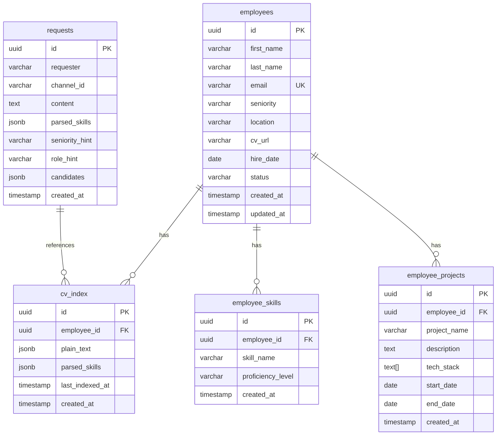

# Database Schema & SQL Reference 🗄️

Documentación completa del schema de la base de datos PostgreSQL utilizada en Mind Tech Stack.

## 📋 Índice

- [Tables Overview](#tables-overview)
- [Schema DDL](#schema-ddl)
- [Índices y Configuraciones](#índices-y-configuraciones)
- [Queries de Ejemplo](#queries-de-ejemplo)
- [Relaciones y Constraints](#relaciones-y-constraints)
- [Performance Best Practices](#performance-best-practices)

## 📊 Tables Overview



## 🏗️ Schema DDL

### Table: `employees`

```sql
CREATE TABLE employees (
    id UUID PRIMARY KEY DEFAULT gen_random_uuid(),
    first_name VARCHAR NOT NULL,
    last_name VARCHAR NOT NULL,
    email VARCHAR UNIQUE NOT NULL,
    seniority VARCHAR CHECK (seniority IN ('JR', 'SSR', 'SR', 'STAFF', 'PRINC')),
    location VARCHAR,
    cv_url VARCHAR,
    hire_date DATE,
    status VARCHAR DEFAULT 'active' CHECK (status IN ('active', 'inactive', 'on_leave')),
    created_at TIMESTAMP DEFAULT NOW(),
    updated_at TIMESTAMP DEFAULT NOW()
);

-- Trigger para updated_at
CREATE OR REPLACE FUNCTION trigger_set_timestamp()
RETURNS TRIGGER AS $$
BEGIN
  NEW.updated_at = NOW();
  RETURN NEW;
END;
$$ LANGUAGE plpgsql;

CREATE TRIGGER set_timestamp_employees
    BEFORE UPDATE ON employees
    FOR EACH ROW
    EXECUTE FUNCTION trigger_set_timestamp();
```

### Table: `cv_index`

```sql
CREATE TABLE cv_index (
    id UUID PRIMARY KEY DEFAULT gen_random_uuid(),
    employee_id UUID NOT NULL REFERENCES employees(id) ON DELETE CASCADE,
    plain_text JSONB, -- Structured data from n8n agent
    parsed_skills JSONB, -- Legacy format for backward compatibility
    last_indexed_at TIMESTAMP DEFAULT NOW(),
    created_at TIMESTAMP DEFAULT NOW()
);

-- Ensure only one CV index per employee
CREATE UNIQUE INDEX idx_cv_index_employee_unique ON cv_index(employee_id);
```

### Table: `employee_skills`

```sql
CREATE TABLE employee_skills (
    id UUID PRIMARY KEY DEFAULT gen_random_uuid(),
    employee_id UUID NOT NULL REFERENCES employees(id) ON DELETE CASCADE,
    skill_name VARCHAR NOT NULL,
    proficiency_level VARCHAR NOT NULL CHECK (
        proficiency_level IN ('basic', 'intermediate', 'advanced', 'expert')
    ),
    created_at TIMESTAMP DEFAULT NOW()
);

-- Ensure unique skill per employee (no duplicates)
CREATE UNIQUE INDEX idx_employee_skills_unique 
ON employee_skills(employee_id, skill_name);
```

### Table: `requests`

```sql
CREATE TABLE requests (
    id UUID PRIMARY KEY DEFAULT gen_random_uuid(),
    requester VARCHAR DEFAULT 'admin',
    channel_id VARCHAR DEFAULT 'web app',
    content TEXT,
    parsed_skills JSONB, -- Structured requirements from n8n
    seniority_hint VARCHAR,
    role_hint VARCHAR,
    candidates JSONB, -- Array of matched candidates with scores
    created_at<｜tool▁call▁begin｜>ESTAMP DEFAULT NOW()
);

-- Add GIN index for JSONB fields
CREATE INDEX idx_requests_parsed_skills ON requests USING gin(parsed_skills);
CREATE INDEX idx_requests_candidates ON requests USING gin(candidates);
```

### Table: `employee_projects`

```sql
CREATE TABLE employee_projects (
    id UUID PRIMARY KEY DEFAULT gen_random_uuid(),
    employee_id UUID NOT NULL REFERENCES employees(id) ON DELETE CASCADE,
    project_name VARCHAR NOT NULL,
    description TEXT,
    tech_stack TEXT[], -- Array of technologies used
    start_date DATE,
    end_date DATE,
    created_at TIMESTAMP DEFAULT NOW()
);
```

### Supporting Table: `skills_reference`

```sql
-- Optional: Centralized skills catalog
CREATE TABLE skills_reference (
    id UUID PRIMARY KEY DEFAULT gen_random_uuid(),
    name VARCHAR UNIQUE NOT NULL,
    description TEXT,
    category VARCHAR CHECK (
        category IN ('programming_language', 'framework', 'database', 'tool', 'cloud', 'other')
    ),
    aliases TEXT[], -- Alternative names (e.g., 'JS', 'JavaScript')
    created_at TIMESTAMP DEFAULT NOW(),
    updated_at TIMESTAMP DEFAULT NOW()
);
```

## 📈 Índices y Configuraciones

### Performance Indexes

```sql
-- Primary performance indexes
CREATE INDEX idx_employees_seniority ON employees(seniority);
CREATE INDEX idx_employees_status ON employees(status);
CREATE INDEX idx_employees_email ON employees(email);
CREATE INDEX idx_cv_index_employee_id ON cv_index(employee_id);
CREATE INDEX idx_cv_index_last_indexed ON cv_index(last_indexed_at);
CREATE INDEX idx_employee_skills_employee_id ON employee_skills(employee_id);
CREATE INDEX idx_employee_skills_skill_name ON employee_skills(skill_name);
CREATE INDEX idx_requests_created_at ON requests(created_at);
CREATE INDEX idx_requests_channel ON requests(channel_id);
CREATE INDEX idx_employee_projects_employee_id ON employee_projects(employee_id);

-- Text search indexes
CREATE INDEX idx_employees_fulltext ON employees 
USING gin(to_tsvector('english', first_name || ' ' || last_name || ' ' || COALESCE(location, '')));

CREATE INDEX idx_requests_content_search ON requests 
USING gin(to_tsvector('english', content));

CREATE INDEX idx_employee_projects_tech_stack ON employee_projects 
USING gin(tech_stack);
```

### Composite Indexes for Common Queries

```sql
-- Employee search by location and seniority
CREATE INDEX idx_employees_location_seniority ON employees(location, seniority) 
WHERE status = 'active';

-- CV index with indexing status
CREATE INDEX idx_cv_index_recent ON cv_index(employee_id, last_indexed_at) 
WHERE plain_text IS NOT NULL;

-- Skills aggregation queries
CREATE INDEX idx_employee_skills_aggregation ON employee_skills(skill_name, proficiency_level);
```

## 🔍 Queries de Ejemplo

### Dashboard Statistics Queries

#### Empleados con Estadísticas
```sql
-- Count by seniority with location breakdown
SELECT 
    seniority,
    COUNT(*) as total,
    COUNT(CASE WHEN location IS NOT NULL THEN 1 END) as with_location,
    COUNT(CASE WHEN cv_url IS NOT NULL THEN 1 END) as with_cv
FROM employees 
WHERE status = 'active'
GROUP BY seniority
ORDER BY 
    CASE seniority 
        WHEN 'JR' THEN 1
        WHEN 'SSR' THEN 2 
        WHEN 'SR' THEN 3
        WHEN 'STAFF' THEN 4
        WHEN 'PRINC' THEN 5
    END;
```

#### Skills más solicitadas (desde candidates)
```sql
WITH skill_counts AS (
    SELECT 
        skill,
        COUNT(*) as frequency
    FROM (
        SELECT unnest(
            jsonb_array_elements_text(
                candidates->0->'match_details'->'matched_skills'
            )
        ) as skill
        FROM requests r
        WHERE r.candidates IS NOT NULL 
        AND jsonb_array_length(r.candidates) > 0
    ) s
    GROUP BY skill
)
SELECT skill, frequency
FROM skill_counts
ORDER BY frequency DESC
LIMIT 10;
```

#### Historial de solicitudes con métricas
```sql
-- Recent requests with candidate counts and success rate
SELECT 
    DATE_TRUNC('day', created_at) as date,
    COUNT(*) as total_requests,
    AVG(jsonb_array_length(candidates)) as avg_candidates,
    COUNT(CASE WHEN jsonb_array_length(candidates) > 0 THEN 1 END) * 100.0 / COUNT(*) as success_rate
FROM requests
WHERE created_at >= NOW() - INTERVAL '30 days'
GROUP BY DATE_TRUNC('day', created_at)
ORDER BY date DESC;
```

### Matching Queries

#### Exact Match Query
```sql
-- Candidate matching by seniority and required skills
WITH skill_match AS (
    SELECT DISTINCT 
        e.id,
        e.first_name,
        e.last_name,
        e.email,
        e.seniority,
        e.location,
        jsonb_array_length(
            array(
                SELECT jsonb_array_elements_text(
                    ci.plain_text->'skills'
                )
                WHERE jsonb_array_elements_text(ci.plain_text->'skills') 
                ILIKE ANY($1::text[]) -- Required skills
            )
        ) as matched_skills_count
    FROM employees e
    JOIN cv_index ci ON e.id = ci.employee_id
    WHERE e.status = 'active'
    AND e.seniority = $2 -- Required seniority level
    AND ci.plain_text IS NOT NULL
)
SELECT *
FROM skill_match 
WHERE matched_skills_count >= $3 -- Minimum skill matches
ORDER BY matched_skills_count DESC, random()
LIMIT 30;
```

#### Hybrid Skills Query (Manual + Auto)
```sql
-- Combine manual skills and CV-extracted skills
SELECT 
    e.id,
    e.first_name,
    e.last_name,
    e.email,
    e.seniority,
    
    -- Manual skills from employee_skills
    array_agg(DISTINCT es.skill_name) as manual_skills,
    
    -- CV skills from AI extraction
    ci.plain_text->'skills' as cv_skills,
    
    -- Combined unique skills
    array_agg(DISTINCT es.skill_name) || 
    COALESCE(ARRAY(
        SELECT jsonb_array_elements_text(ci.plain_text->'skills')
    ), ARRAY[]::text[]) as all_skills

FROM employees e
LEFT JOIN employee_skills es ON e.id = es.employee_id
LEFT JOIN cv_index ci ON e.id = ci.employee_id AND ci.plain_text IS NOT NULL
WHERE e.status = 'active'
GROUP BY e.id, e.first_name, e.last_name, e.email, e.seniority, ci.plain_text
HAVING COUNT(es.skill_name) > 0 OR ci.plain_text IS NOT NULL;
```

### Data Integrity Queries

#### Find Inconsistencies
```sql
-- Employees with CV URL but no CV index
SELECT e.id, e.first_name, e.last_name, e.cv_url
FROM employees e
WHERE e.cv_url IS NOT NULL 
AND NOT EXISTS (
    SELECT 1 FROM cv_index ci 
    WHERE ci.employee_id = e.id 
    AND ci.plain_text IS NOT NULL
);

-- CV indexes without valid employee
SELECT ci.id, ci.employee_id
FROM cv_index ci
WHERE NOT EXISTS (
    SELECT 1 FROM employees e WHERE e.id = ci.employee_id
);

-- Requests without valid structured data
SELECT id, content
FROM requests r
WHERE (
    r.parsed_skills IS NULL 
    OR r.candidates IS NULL 
    OR jsonb_array_length(r.candidates) = 0
);
```

#### Data Health Check
```sql
-- Summary of data integrity
SELECT 
    'employees' as table_name,
    COUNT(*) as total_count,
    COUNT(CASE WHEN status = 'active' THEN 1 END) as active_count
FROM employees

UNION ALL

SELECT 
    'cv_index',
    COUNT(*),
    COUNT(CASE WHEN plain_text IS NOT NULL THEN 1 END)
FROM cv_index

UNION ALL

SELECT 
    'employee_skills',
    COUNT(*),
    COUNT(*)
FROM employee_skills

UNION ALL

SELECT 
    'requests',
    COUNT(*),
    COUNT(CASE WHEN created_at >= NOW() - INTERVAL '7 days' THEN 1 END)
FROM requests;
```

## 🔗 Relaciones y Constraints

### Foreign Key Relationships

```sql
-- Restrict cascade deletes appropriately
ALTER TABLE cv_index 
ADD CONSTRAINT fk_cv_index_employee 
FOREIGN KEY (employee_id) REFERENCES employees(id) 
ON DELETE CASCADE;

ALTER TABLE employee_skills 
ADD CONSTRAINT fk_employee_skills_employee 
FOREIGN KEY (employee_id) REFERENCES employees(id) 
ON DELETE CASCADE;

ALTER TABLE employee_projects 
ADD CONSTRAINT fk_employee_projects_employee 
FOREIGN KEY (employee_id) REFERENCES employees(id) 
ON DELETE CASCADE;
```

### Check Constraints

```sql
-- Validate JSONB structure
ALTER TABLE cv_index 
ADD CONSTRAINT check_cv_data_structure 
CHECK (
    plain_text IS NULL OR (
        plain_text ? 'role' AND 
        plain_text ? 'skills' AND 
        jsonb_typeof(plain_text->'skills') = 'array'
    )
);

-- Validate email format
ALTER TABLE employees 
ADD CONSTRAINT check_email_format 
CHECK (email ~* '^[A-Za-z0-9._%+-]+@[A-Za-z0-9.-]+\.[A-Za-z]{2,}$');

-- Validate seniority progression
ALTER TABLE employees 
ADD CONSTRAINT check_seniority_progression 
CHECK (
    seniority IN ('JR', 'SSR', 'SR', 'STAFF', 'PRINC')
);
```

## ⚡ Performance Best Practices

### Query Optimization Tips

#### 1. Use Partial Indexes for Common Filters
```sql
-- Index only for active employees
CREATE INDEX idx_employees_active_seniority 
ON employees(seniority) 
WHERE status = 'active';

-- Index recent CV indexing activity  
CREATE INDEX idx_cv_recent_activity
ON cv_index(last_indexed_at)
WHERE last_indexed_at >= NOW() - INTERVAL '1 month';
```

#### 2. Composite Index Strategy
```sql
-- For employee search by multiple criteria
CREATE INDEX idx_employees_search_optimized 
ON employees(seniority, status, location) 
WHERE status = 'active';

-- For dashboard aggregations
CREATE INDEX idx_requests_analytics 
ON requests(created_at, channel_id);
```

#### 3. Efficient Pagination
```sql
-- Use cursor-based pagination for large datasets
WITH paginated_employees AS (
    SELECT e.id, e.first_name, e.last_name, e.email, e.seniority
    FROM employees e
    WHERE e.created_at < $cursor_timestamp  -- Use timestamp as cursor
    ORDER BY e.created_at DESC
    LIMIT $limit OFFSET $offset
)
SELECT * FROM paginated_employees;
```

### Maintenance Queries

#### Database Statistics Update
```sql
-- Update statistics for query planner optimization
ANALYZE employees;
ANALYZE cv_index;  
ANALYZE employee_skills;
ANALYZE requests;
```

#### Index Usage Monitoring
```sql
-- Check which indexes are being used
SELECT 
    schemaname,
    tablename,
    attname,
    n_distinct,
    correlation
FROM pg_stats 
WHERE tablename IN ('employees', 'cv_index', 'employee_skills', 'requests')
ORDER BY tablename, attname;
```

---

Para deployment y migración, ver los archivos en `infra/supabase/schema.sql` y `infra/supabase/seed.sql`.
