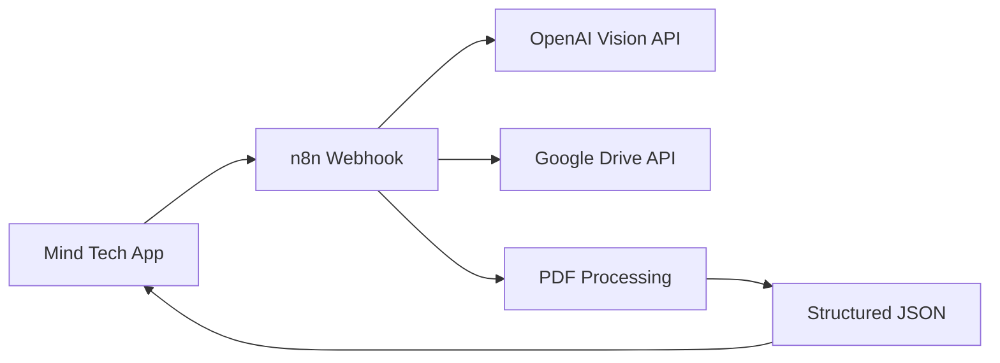
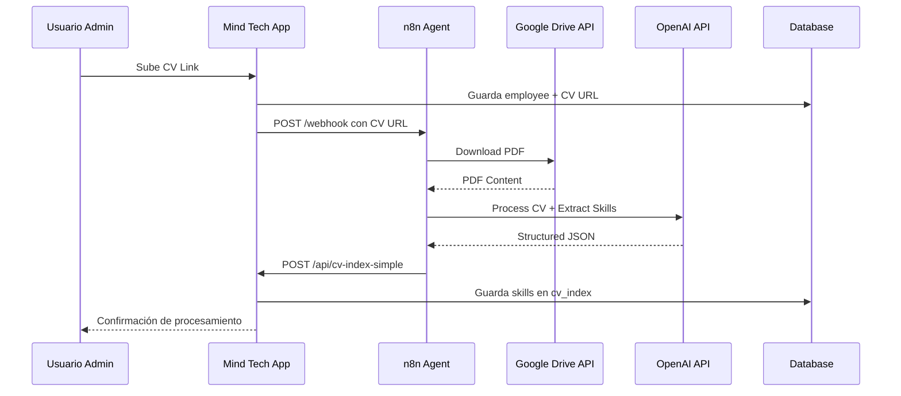
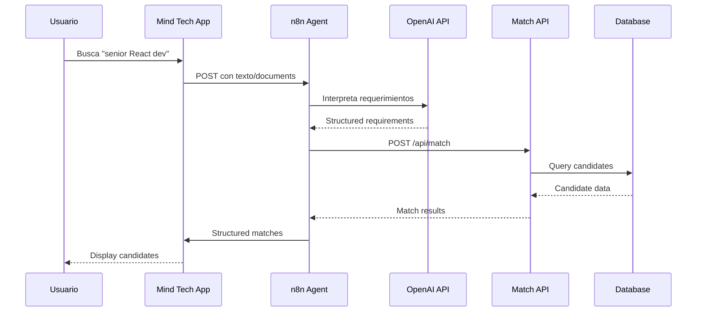

# Integración con n8n 🤖

Esta documentación detalla cómo funciona la integración entre la aplicación Mind Tech Stack y los workflows de n8n para procesamiento automático de CVs y matching de candidatos.

## 📋 Índice

- [Overview de la Integración](#overview-de-la-integración)
- [Webhooks de n8n](#webhooks-de-n8n)
- [Flujo de Procesamiento de CVs](#flujo-de-procesamiento-de-cvs)
- [Flujo de Búsqueda y Matching](#flujo-de-búsqueda-y-matching)
- [Configuración Requerida](#configuración-requerida)
- [Troubleshooting](#troubleshooting)

## 🌐 Overview de la Integración

n8n actúa como un **agente inteligente** que:

1. **Procesa CVs**: Descarga documentos de Google Drive, extrae texto usando OpenAI, y estructura la información
2. **Hace Búsquedas Semánticas**: Interpreta requerimientos de trabajo y los convierte en criterios de búsqueda estructurados
3. **Facilita Matching**: Conecta la aplicación web con la IA para análisis avanzado de habilidades



## 🔗 Webhooks de n8n

### 1. Webhook Principal de CV Processing

**Endpoint:** `https://laucho.app.n8n.cloud/webhook/mind-intake`

**Propósito:** Procesamiento automático de CVs cuando se sube o actualiza un empleado

#### Request Payload
```json
{
  "employee_id": "123e4567-e89b-12d3-a456-426614174000",
  "cv_url": "https://docs.google.com/document/d/1abc123.../edit",
  "action": "extract_cv_data"
}
```

#### Response Success
```json
{
  "success": true,
  "cv_data": {
    "role": "Senior Frontend Developer",
    "seniority": "SR",
    "skills": [
      "React",
      "TypeScript",
      "Next.js",
      "Node.js",
      "PostgreSQL"
    ],
    "keywords": [
      "leadership",
      "mentorship",
      "agile",
      "scrum"
    ],
    "last_project": "E-commerce platform for retail company",
    "location": "Buenos Aires, Argentina",
    "summary": "Senior Frontend Developer with 6+ years of experience building scalable React applications..."
  }
}
```

#### Error Response
```json
{
  "success": false,
  "error": "Failed to extract CV data",
  "details": "Unable to access Google Drive document"
}
```

### 2. Webhook de Búsqueda/Matching

**Endpoint:** `https://laucho.app.n8n.cloud/webhook/mind-intake`

**Propósito:** Interpretar requerimientos de trabajo y estructura datos para el motor de matching

#### Text Input
```json
{
  "text": "Need a senior React developer for fintech project",
  "channel_id": "web app"
}
```

#### File Upload (multipart/form-data)
```
file: [PDF_FILE]
text: "Looking for experienced Angular developer"
channel_id: "web app"
```

#### Response
```json
[
  {
    "output": {
      "role": "Senior Frontend Developer",
      "seniority": "SR",
      "must_have": ["React", "TypeScript"],
      "nice_to_have": ["Next.js", "Tailwind CSS"],
      "extra_keywords": ["fintech", "financial"]
    }
  },
  {
    "output": {
      "role": "Frontend Developer",
      "seniority": "SR", 
      "must_have": ["Angular", "TypeScript"],
      "nice_to_have": ["RxJS", "Material UI"],
      "extra_keywords": ["angular", "responsive"]
    }
  }
]
```

## 🔄 Flujo de Procesamiento de CVs



### Detalles del Proceso

1. **Trigger**: Cuando un usuario sube una CV URL en el formulario de empleados
2. **Validation**: La app valida que la URL sea de Google Drive
3. **n8n Processing**: El webhook descarga el PDF y usa OpenAI para extraer:
   - Rol y nivel de senioridad detectado
   - Lista de habilidades técnicas
   - Palabras clave adicionales
   - Último proyecto mencionado
   - Ubicación/location
   - Resumen profesional

4. **Database Storage**: Los datos estructurados se guardan en `cv_index.plain_text`

## 🔍 Flujo de Búsqueda y Matching



### Detalles del Matching

1. **Input Processing**: n8n analiza texto libre o documentos CVs subidos
2. **Semantic Understanding**: OpenAI convierte requerimientos en:
   - Rol específico identificado
   - Nivel de senioridad sugerido  
   - Skills obligatorios (`must_have`)
   - Skills deseables (`nice_to_have`)
   - Palabras clave adicionales para contexto

3. **Matching Engine**: El motor local ejecuta algoritmo de scoring:
   - Intersección de skills obligatorios
   - Bonus por skills deseables
   - Matching de senioridad (±1 nivel)
   - Scoring combinado para ranking

## ⚙️ Configuración Requerida

### En n8n Platform

#### Credentials Necesarios
1. **OpenAI API**
   - Tipo: Bearer Token
   - Token: `sk-your-openai-key`

2. **Google Drive Service Account**
   - Tipo: Service Account JSON
   - Archivo: Service account credentials JSON

3. **HTTP Request Authentication**
   - Tipo: Basic Auth
   - Username: `BASIC AUTH USER`
   - Password: `BASIC AUTH PASS`

#### Environment Variables en n8n
```bash
# OpenAI Configuration
OPENAI_API_KEY=sk-your-openai-key
OPENAI_MODEL=gpt-4-vision-preview

# Google Drive Configuration  
GOOGLE_DRIVE_FOLDER_ID=your-shared-folder-id
GOOGLE_DRIVE_SERVICE_ACCOUNT_PATH=/path/to/service-account.json

# Mind Tech App Configuration
MIND_TECH_API_BASE_URL=https://your-app.vercel.app
MIND_TECH_BASIC_AUTH_USER=admin
MIND_TECH_BASIC_AUTH_PASS=secure-password

# Webhook URLs
N8N_WEBHOOK_BASE_URL=https://laucho.app.n8n.cloud/webhook
```

#### Workflow Components

##### CV Processing Workflow
```
Webhook Trigger
    ↓
Extract employee_id & cv_url
    ↓
Google Drive: Download PDF
    ↓
OpenAI Vision: Extract text & structure
    ↓
Transform JSON response
    ↓
HTTP Request: POST /api/cv-index-simple
    ↓
Return success/error to webhook originator
```

##### Search/Matching Workflow  
```
Webhook Trigger
    ↓
Check input type (text vs file)
    ↓
If file: Use OpenAI Vision
If text: Use OpenAI Text
    ↓
Structure requirements JSON
    ↓
For each structured requirement:
  - POST /api/match
  - Collect candidates
    ↓
Return combined results
```

### En Mind Tech App

#### Environment Variables
```bash
# n8n Integration URLs
N8N_WEBHOOK_URL=https://laucho.app.n8n.cloud/webhook/mind-intake
N8N_WEBHOOK_URL=https://laucho.app.n8n.cloud/webhook/mind-intake

# External API Keys (also needed by n8n)
OPENAI_API_KEY=sk-your-openai-key
GOOGLE_DRIVE_SERVICE_ACCOUNT_KEY=your-service-account-json
```

#### API Endpoints Used by n8n

##### `POST /api/cv-index-simple`
```typescript
interface CVIndexRequest {
  employee_id: string; // UUID
  cv_data: string;     // JSON stringified CV data
}

interface CVIndexResponse {
  success: boolean;
  message: string;
  cv_data?: any;
}
```

##### `POST /api/match`
```typescript
interface MatchRequest {
  role: string;
  seniority: 'JR' | 'SSR' | 'SR' | 'STAFF' | 'PRINC';
  must_have: string[];
  nice_to_have: string[];
  extra_keywords: string[];
}

interface MatchResponse {
  candidates: Candidate[];
  total: number;
  message: string;
}
```

##### `POST /api/requests`
```typescript
interface RequestBody {
  requester?: string;
  channel_id?: string;
  content: string;
  parsed_skills: any;
  candidates: Candidate[];
}
```

## 🛠️ Troubleshooting

### Common Issues

#### 1. Authentication Errors
**Error:** `401 Unauthorized`
**Cause:** n8n no está configurado con Basic Auth
**Fix:** 
```bash
# En n8n HTTP Request node:
Authentication: Basic Auth
Username: BASIC_AUTH_USER
Password: BASIC_AUTH_PASS
```

#### 2. CV Processing Failures
**Error:** `Failed to extract CV data`
**Causes Possibles:**
- Google Drive permissions
- OpenAI API rate limits  
- Invalid CV URL format

**Debug Steps:**
1. Verificar que la URL de Google Drive sea pública
2. Confirmar OpenAI API key válido
3. Revisar logs de n8n workflow

#### 3. Matching Results Empty
**Error:** No candidates returned
**Causes Possibles:**
- No skills data en cv_index
- Employees sin CVs indexados
- Seniority mismatch

**Debug Steps:**
1. Verificar tabla `cv_index` tiene datos
2. Confirmar employees tienen niveles de senioridad válidos
3. Testear algoritmo de matching directamente

### Debugging Commands

#### Verificar Datos en Database
```sql
-- Check employees with CVs
SELECT e.first_name, e.last_name, e.seniority, ci.plain_text
FROM employees e 
LEFT JOIN cv_index ci ON e.id = ci.employee_id 
WHERE e.cv_url IS NOT NULL;

-- Check recent requests
SELECT id, parsed_skills, created_at, array_length(candidates, 1) as candidate_count
FROM requests 
ORDER BY created_at DESC 
LIMIT 5;
```

#### Test n8n Webhook Directamente
```bash
# Test CV processing
curl -X POST https://laucho.app.n8n.cloud/webhook/mind-intake \
  -H "Content-Type: application/json" \
  -d '{
    "employee_id": "test-uuid",
    "cv_url": "https://docs.google.com/document/d/your-cv/edit",
    "action": "extract_cv_data"
  }'

# Test search processing  
curl -X POST https://laucho.app.n8n.cloud/webhook/mind-intake \
  -H "Content-Type: application/json" \
  -d '{
    "text": "need senior react developer",
    "channel_id": "web app"
  }'
```

### Monitoring

#### n8n Execution Logs
```
Workspace → Executions → Filter by 'mind-intake'
```

#### Application Logs
```bash
# En Vercel dashboard o local development
# Logs aparecerán en console cuando se ejecuten webhooks
```

#### Database Monitoring
```sql
-- Recent CV processing activity
SELECT 
  e.first_name || ' ' || e.last_name as employee,
  ci.last_indexed_at,
  ci.plain_text->>'role' as extracted_role
FROM cv_index ci
JOIN employees e ON ci.employee_id = e.id
WHERE ci.last_indexed_at > NOW() - INTERVAL '1 day'
ORDER BY ci.last_indexed_at DESC;
```

---

Para más detalles técnicos, ver el [README principal](../READEME.md) y los comentarios en el código de las API routes.
