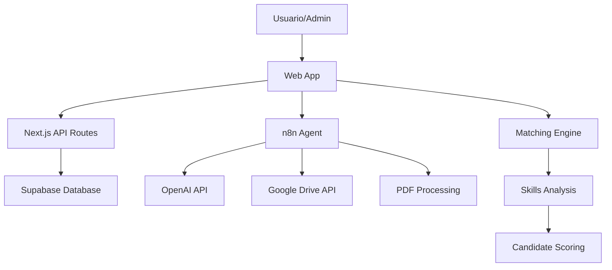
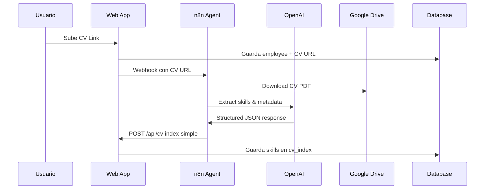

# Mind Tech Stack 🧠⚡

Una aplicación de gestión de talento técnico que conecta requerimientos de trabajo con empleados calificados utilizando inteligencia artificial y automatización.

## 📋 Tabla de Contenidos

- [Arquitectura General](#arquitectura-general)
- [Stack Tecnológico](#stack-tecnológico)
- [Features Principales](#features-principales)
- [Integración con n8n](#integración-con-n8n)
- [Base de Datos](#base-de-datos)
- [API Endpoints](#api-endpoints)
- [Configuración](#configuración)
- [Despliegue](#despliegue)
- [Contribución](#contribución)

## 🏗️ Arquitectura General



El proyecto combina:
- **Frontend**: Next.js con TailwindCSS para una UI moderna
- **Backend**: API Routes de Next.js con middleware de autenticación
- **Base de Datos**: Supabase (PostgreSQL) para persistencia
- **IA Agent**: n8n workflow que procesa CVs y extrae habilidades
- **Integración**: APIs externas (Google Drive, OpenAI) vía n8n

## 🛠️ Stack Tecnológico

### Frontend
- **Next.js 14** - Framework React con SSR/SSG
- **TailwindCSS** - Sistema de diseño utilitario
- **TypeScript** - Tipado estático para mejor DX

### Backend
- **Next.js API Routes** - Servidor backend integrado
- **Supabase** - Base de datos PostgreSQL + Auth + Storage
- **Middleware** - Autenticación básica HTTP

### Automatización & IA
- **n8n** - Workflow automation platform
- **OpenAI API** - Procesamiento de lenguaje natural
- **Google Drive API** - Manejo de documentos CV

## ✨ Features Principales

### 👥 Gestión de Empleados
- Registro completo de empleados con metadata técnica
- Upload y gestión de CVs vía Google Drive links
- Sistema de habilidades técnicas categorizado
- Dashboard administrativo con métricas en tiempo real

### 🔍 Motor de Matching Inteligente
- Búsqueda semántica de candidatos por requerimientos
- Algoritmo de scoring basado en relación de habilidades
- Filtrado por nivel de senioridad (±1 nivel)
- Fallback con algoritmos de relajación de criterios

### 📊 Analytics & Reporting
- Dashboard con métricas de uso
- Top habilidades más demandadas
- Empleados más sugeridos
- Historial de solicitudes de matching

### 🔄 Automatización de CVs
- Procesamiento automático al subir nuevas CVs
- Extracción de habilidades usando IA
- Detección de cambios en documentos Google Drive
- Re-indexación automática cuando se actualiza empleado

## 🔗 Integración con n8n

### Flujo Principal de Procesamiento



### Endpoints de n8n

#### Webhook Principal de CV Processing
```http
POST https://laucho.app.n8n.cloud/webhook/mind-intake
```

**Input Body:**
```json
{
  "employee_id": "uuid",
  "cv_url": "https://docs.google.com/document/...",
  "action": "extract_cv_data"
}
```

**Output Body:**
```json
{
  "success": true,
  "cv_data": {
    "role": "Senior Frontend Developer",
    "seniority": "SR",
    "skills": ["react", "typescript", "next.js"],
    "keywords": ["leadership", "mentorship"],
    "last_project": "E-commerce platform for Acme Corp",
    "location": "Buenos Aires, Argentina",
    "summary": "Desarrollador frontend senior con 6 años de experiencia..."
  }
}
```

#### Webhook de Busqueda/Matching
```http
POST https://laucho.app.n8n.cloud/webhook-test/mind-intake
```

**Input Body:**
```json
{
  "text": "senior frontend react developer",
  "channel_id": "web app"
}
```

**Input FormData (file upload):**
```multipart/form-data
file: [CV_PDF_FILE]
text: "search description"
channel_id: "web app"
```

### Confuraciones de n8n Requeridas

1. **Basic Auth** para endpoints protegidos:
   - Usuario: `BASIC AUTH USER`
   - Password: `BASIC AUTH PASS`

2. **Credentials necesarias**:
   - OpenAI API Key
   - Google Drive Service Account
   - HTTP Request nodes configurados

## 🗄️ Base de Datos

### Schema Principal

```sql
-- Employees table
CREATE TABLE employees (
    id UUID PRIMARY KEY DEFAULT gen_random_uuid(),
    first_name VARCHAR NOT NULL,
    last_name VARCHAR NOT NULL,
    email VARCHAR UNIQUE NOT NULL,
    seniority VARCHAR CHECK (seniority IN ('JR', 'SSR', 'SR', 'STAFF', 'PRINC')),
    location VARCHAR,
    cv_url VARCHAR, -- Google Drive link
    hire_date DATE,
    status VARCHAR DEFAULT 'active',
    created_at TIMESTAMP DEFAULT NOW(),
    updated_at TIMESTAMP DEFAULT NOW()
);

-- CV Index table (AI extracted data)
CREATE TABLE cv_index (
    id UUID PRIMARY KEY DEFAULT gen_random_uuid(),
    employee_id UUID REFERENCES employees(id) ON DELETE CASCADE,
    plain_text JSONB, -- Structured data from n8n agent
    parsed_skills JSONB, -- Legacy skills format
    last_indexed_at TIMESTAMP DEFAULT NOW(),
    created_at TIMESTAMP DEFAULT NOW()
);

-- Employee Skills (manual skills)
CREATE TABLE employee_skills (
    id UUID PRIMARY KEY DEFAULT gen_random_uuid(),
    employee_id UUID REFERENCES employees(id) ON DELETE CASCADE,
    skill_name VARCHAR NOT NULL,
    proficiency_level VARCHAR CHECK (proficiency_level IN ('basic', 'intermediate', 'advanced', 'expert')),
    created_at TIMESTAMP DEFAULT NOW()
);

-- Matching Requests History
CREATE TABLE requests (
    id UUID PRIMARY KEY DEFAULT gen_random_uuid(),
    requester VARCHAR DEFAULT 'admin',
    channel_id VARCHAR DEFAULT 'web app',
    content TEXT,
    parsed_skills JSONB, -- Structured data from n8n
    seniority_hint VARCHAR,
    role_hint VARCHAR,
    candidates JSONB, -- Array of matched candidates with scores
    created_at TIMESTAMP DEFAULT NOW()
);

-- Employee Technical Projects
CREATE TABLE employee_projects (
    id UUID PRIMARY KEY DEFAULT gen_random_uuid(),
    employee_id UUID REFERENCES employees(id) ON DELETE CASCADE,
    project_name VARCHAR NOT NULL,
    description TEXT,
    tech_stack TEXT[], -- Array of technologies used
    start_date DATE,
    end_date DATE,
    created_at TIMESTAMP DEFAULT NOW()
);
```

### Índices Recomendados

```sql
-- Performance indexes
CREATE INDEX idx_employees_seniority ON employees(seniority);
CREATE INDEX idx_cv_index_employee_id ON cv_index(employee_id);
CREATE INDEX idx_employee_skills_employee_id ON employee_skills(employee_id);
CREATE INDEX idx_requests_created_at ON requests(created_at);

-- Text search indexes
CREATE INDEX idx_employees_fulltext ON employees USING gin(to_tsvector('english', first_name || ' ' || last_name));
CREATE INDEX idx_requests_content_search ON requests USING gin(to_tsvector('english', content));
```

## 🔌 API Endpoints

### Authentication
Todos los endpoints requieren Basic Auth HTTP:
```http
Authorization: Basic base64(username:password)
```

### Employees Management

#### `GET /api/employees`
Lista todos los empleados con paginación
```json
{
  "employees": [...],
  "total": 150,
  "hasMore": true
}
```

#### `POST /api/employees`
Crear nuevo empleado
```json
{
  "first_name": "Juan",
  "last_name": "Pérez",
  "email": "juan@example.com",
  "seniority": "SR",
  "location": "Buenos Aires",
  "cv_url": "https://docs.google.com/document/..."
 }
```

#### `PUT /api/employees/{id}`
Actualizar empleado (trigger auto-reindex si tiene CV)

#### `POST /api/employees/{id}/cv`
Upload CV (trigger auto-index vía n8n)

### CV Processing

#### `POST /api/cv-index-simple`
Guardar datos de CV procesados por n8n
```json
{
  "employee_id": "uuid",
  "cv_data": "{\"role\":\"Developer\",\"skills\":[...]}"
}
```

### Matching Engine

#### `POST /api/match`
Motor principal de matching de candidatos
```json
{
  "role": "Senior Frontend Developer",
  "seniority": "SR",
  "must_have": ["react", "typescript"],
  "nice_to_have": ["next.js", "tailwindcss"],
  "extra_keywords": ["leadership", "mentorship"]
}
```

**Response:**
```json
{
  "candidates": [
    {
      "employee_id": "uuid",
      "name": "Juan Pérez",
      "email": "juan@example.com",
      "seniority": "SR",
      "match_score": 0.85,
      "summary": "Senior developer...",
      "cv_index": {...}
    }
  ],
  "total": 4,
  "message": "Found 4 matching candidates"
}
```

#### `GET /api/match?role=Developer&seniority=SR`
Matching via query parameters (convierte a POST internamente)

### Request Tracking

#### `GET /api/requests`
Lista histórico de solicitudes con filtros
Query params: `limit`, `offset`, `q`, `role`, `seniority`, `channel`

#### `POST /api/requests`
Guardar solicitud con candidatos (usado por n8n)

## ⚙️ Configuración

### Environment Variables

```bash
# Database
SUPABASE_URL=https://your-project.supabase.co
SUPABASE_SERVICE_ROLE_KEY=your-service-role-key

# Authentication
BASIC_AUTH_USER=admin
BASIC_AUTH_PASS=secure-password

# External APIs
OPENAI_API_KEY=sk-your-openai-key
GOOGLE_DRIVE_SERVICE_ACCOUNT=path/to/service-account.json

# n8n Integration
N8N_WEBHOOK_URL=https://laucho.app.n8n.cloud/webhook/mind-intake
N8N_TEST_WEBHOOK_URL=https://laucho.app.n8n.cloud/webhook-test/mind-intake
```

### Instalación Local

```bash
# Clone repository
git clone <repository-url>
cd mind-tech-stack

# Install dependencies
npm install

# Setup environment
cp .env.example .env.local
# Edit .env.local with your credentials

# Database setup
npm run db:setup
npm run db:seed

# Run development server
npm run dev
# App runs on http://localhost:3000
```

### Estructura de Directorios

```
apps/
├── mind-tech-app/          # Main Next.js application
│   ├── src/app/
│   │   ├── api/            # API routes
│   │   ├── components/     # UI components
│   │   ├── employees/      # Employee management pages
│   │   ├── requests/       # Request history pages
│   │   └── search-matches/ # Search interface
│   ├── src/lib/           # Utilities & configuration
│   └── src/middleware.ts   # Auth middleware
│
infra/
├── supabase/              # Database schema & seeds
└── n8n/                   # n8n workflow configs

packages/
└── shared/                # Shared types & utilities
```

## 🚀 Despliegue

### Vercel (Recomendado)

1. **Connect repository** to Vercel
2. **Set environment variables** in Vercel dashboard
3. **Deploy automatically** on git push

### Database Migration

```bash
# Run migrations in Supabase dashboard or CLI
supabase db push
```

### n8n Workflow Setup

1. Import workflows from `infra/n8n/` directory
2. Configure credentials (OpenAI, Google Drive)
3. Set webhook URLs to production domains
4. Test workflow with sample data

## 🤝 Contribución

### Development Workflow

1. **Feature Branch**: `git checkout -b feature/new-feature`
2. **Development**: Local testing with `npm run dev`
3. **Testing**: Manual testing + API endpoint verification
4. **Pull Request**: Document changes and test results
5. **Code Review**: Team review before merge
6. **Deploy**: Automatic deployment to staging/production

### Code Standards

- **TypeScript**: Strict typing enabled
- **ESLint**: Configured for Next.js best practices
- **Prettier**: Code formatting
- **Commits**: Conventional commit messages
- **Documentation**: JSDoc comments for complex functions

### Testing Strategy

- **Manual Testing**: UI workflows and API endpoints
- **Integration Testing**: Database operations and external APIs
- **Production Testing**: Real data validation in staging environment

## 📞 Soporte

Para soporte técnico o preguntas sobre integración:
- **Documentation**: Este README y comentarios en el código
- **Issues**: GitHub Issues para bugs y feature requests
- **Development**: Contacto directo con el equipo de desarrollo

---

**Desarrollado con ❤️ para optimizar la gestión de talento técnico**